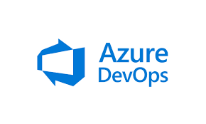

## Hey 👋, I'm [Roydon Pereira!](https://github.com/roydon-p/)

 
 &nbsp;

I am a Full-Stack developer with over 7 years of coding experience.

I hold a Master's degree in Computer Science 📠from Northeastern University, Boston ğŸ›. 

I'm experienced in C#.NET, Java, and React, and proficient in database management systems. 

I have led cross-functional teams, fostering collaboration and delivering successful software projects on time and within budget.

I'm a passionate learner who's always willing to learn and work across technologies and domains 💡. 

 I love to explore new technologies and leverage them to solve real-life problems ✨.

My goal with coding is to help others. I enjoy being able to create something that other people can use to make their lives easier.

### My Hobbies:
- 💻 &nbsp; Love exploring new tech stacks and building cool stuff.
- 🍕 &nbsp; Cooking, eating, and exploring new food/places.

### Technologies I'm good at:

### Technologies I'm learning:

<!--
**roydon-p/roydon-p** is a ✨ _special_ ✨ repository because its `README.md` (this file) appears on your GitHub profile.

Here are some ideas to get you started:

- 🔭 I’m currently working on ...
- 🌱 I’m currently learning ...https://raw.githubusercontent.com/github/explore/80688e429a7d4ef2fca1e82350fe8e3517d3494d/topics/
- 👯 I’m looking to collaborate on ...
- 🤔 I’m looking for help with ...
- 💬 Ask me about ...
- 📫 How to reach me: ...
- 😄 Pronouns: ...
- ⚡ Fun fact: ...
-->
